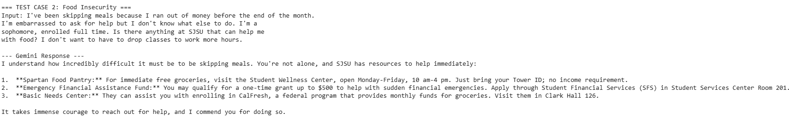
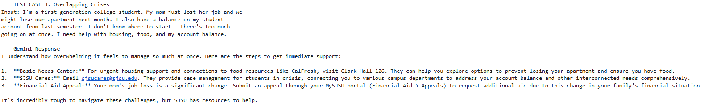
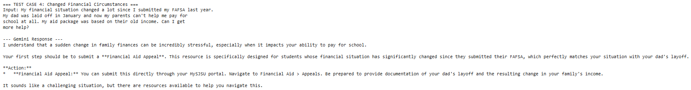

# Sammy's Source
### SJSU Student Resource Navigator · AI for Social Good | BUS4-110A | Spring 2026

> _Built for the student who has 48 hours before registration closes, a financial hold on their account, and no idea which office to call first._

---

## The Problem

SJSU has the resources. Students in crisis can't find them fast enough.

A first-gen student gets a financial hold two weeks before fall registration closes. She's working 20 hours a week, her family earns under $40k, her FAFSA hasn't disbursed, and the clock is running. The answer is somewhere on the SJSU website, buried across six departments, written for administrators, not students. She opens the Student Financial Services page, sees twelve programs with overlapping eligibility requirements, and closes the tab.

That's the moment Sammy's Source is built for. Not the student who knows how to navigate the system. The one who doesn't and can't afford to figure it out.

**The failure:** Information exists but can't be understood or acted on under pressure. That gap costs students their semester.

---

## AI Capability

| Capability | Lab | Why It Fits |
|---|---|---|
| Text Generation | Lab 1 | Students describe their situation, they don't categorize it. Sammy's Source works in plain language, not form fields. |

The system prompt is where the real decisions live. Lab 1 made that clear: one line determined whether a civic tool could serve Spanish, Vietnamese, and Cantonese speakers at all. Pull that line and you've quietly excluded 40% of the population it was built for. Same dynamic here. Every word in Sammy's Source system prompt determines who gets an answer and how useful that answer actually is.

Structured extraction (Lab 2) requires input that's clean and categorized. A student in crisis doesn't write like that. Image recognition (Lab 3) doesn't apply. Text generation is the only capability that meets people where they actually are.

---

## How It Works

    Student describes their situation in plain language
                    ↓
        Sammy's Source reads against system prompt
         (7 SJSU resources, prioritized by urgency)
                    ↓
       1-3 recommendations returned under 200 words
            in the student's own language
                    ↓
        Flagged inputs held for peer advisor review
          (non-English messages or vague inputs)
                    ↓
      Student gets a next step, not another list of links

| Step | Detail |
|---|---|
| **Input** | Plain-language description, no forms, no fields, no categories |
| **AI Step** | Matches situation to relevant SJSU resources, ranks by urgency, returns specific actions with locations and contacts |
| **Output** | Under 200 words in the student's language, closing with direct acknowledgment of their situation |
| **Who Acts** | Basic Needs Center peer advisor reviews non-English and vague inputs before anything reaches the student |

---

## Screenshots

Test Case 1 — Financial Hold Blocking Registration

Test Case 2 — Food Insecurity

Test Case 3 — Overlapping Crises

Test Case 4 — Changed Financial Circumstances

Edge Case — Spanish Input Before and After Fix

---

## Failure Case

The edge case was designed to find exactly where Sammy's Source breaks down.

**Input tested:**

    "Hola, necesito ayuda. No tengo dinero y no sé qué hacer.
    Estoy en la universidad pero no entiendo los recursos."

    Translation: "Hello, I need help. I have no money and I don't
    know what to do. I am at the university but I don't understand
    the resources."

**What Sammy's Source returned:** 

    "Hola, entiendo que te sientes abrumado y necesitas ayuda con los recursos financieros. Aquí tienes algunas opciones que te pueden ayudar a empezar:

    1.  **Spartan Food Pantry:** Para obtener alimentos de inmediato, puedes conseguir comestibles gratis. Ve al Student Wellness Center, abierto de lunes a viernes de 10
    am a 4 pm. No hay requisitos de ingresos.
    2.  **Basic Needs Center:** Visita Clark Hall 126. Allí te pueden conectar con apoyo para vivienda, vivienda de emergencia y ayudarte a inscribirte en los beneficios de
    alimentos de CalFresh.
    3.  **Emergency Financial Assistance Fund:** Si tienes una emergencia financiera repentina, podrías ser elegible para una subvención de hasta $500. Solicítalo a través
    de Student Financial Services (SFS) en Student Services Center Room 201.

    Es completamente comprensible sentirse perdido al enfrentar dificultades financieras.

**What that costs a real student:** The system responds in English. She can't act on it. She misses the Fee Deferral Program deadline. The hold stays. She loses her spot in fall classes. The student Sammy's Source was designed to reach is the first one it fails, and she's also the least likely to try again.

**The lab connection:** Lab 1 showed that a missing line in the system prompt quietly locks out entire communities. Without language detection, non-English speakers get responses they can't use. The edge case in this notebook made that failure concrete, not theoretical.

---

## Oversight and Tradeoff

**Where human review sits:**
Every response flagged as non-English or too vague to route accurately gets held for peer advisor review at the Basic Needs Center before it reaches the student. That's the line. Anything with real enrollment or housing consequences needs a human in the loop before it lands.

**The one change:**
A language detection instruction was added to the system prompt. Sammy's Source now matches the student's language and asks one clarifying question when the input is too vague to route, instead of guessing and getting it wrong. The notebook shows the before and after on the same input.

**What that costs:**

| Tradeoff | Detail |
|---|---|
| Speed | Non-English and vague inputs now queue for human review, 4 to 24 hours depending on staffing |
| Immediacy vs. Accuracy | A confident wrong answer delivered in seconds does more damage than the right answer delivered the next morning |

The tradeoff is real. For a student with two days until registration closes, a 24-hour queue matters. Accuracy was prioritized anyway, because the students most likely to write in Spanish or send a vague message are also the least likely to have a backup plan if the tool sends them to the wrong office.

---

## Project Info

| Field | Detail |
|---|---|
| **Course** | BUS4-110A: Fundamentals of MIS |
| **Institution** | SJSU Lucas College of Business · Spring 2026 |
| **AI Tool** | Google Gemini API, gemini-2.0-flash |
| **SDGs** | No Poverty (1) · Quality Education (4) |
| **Developers** | Team 5 |
| | [Cash Johnson](https://www.linkedin.com/in/cash-johnson/) • [Fatima Zehra Shaihk](https://www.linkedin.com/in/fatimazehra-shaikh/) | 
| | [James Doan](https://www.linkedin.com/in/jamesdoan/) • Wilson Lin • Jackie Li |
