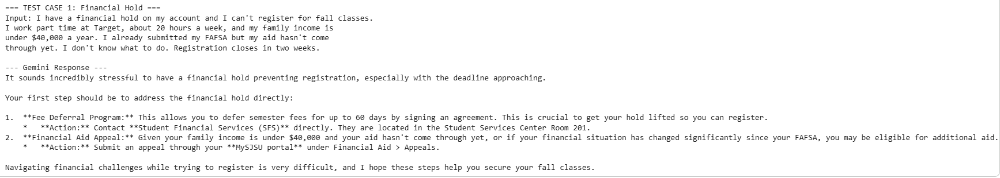
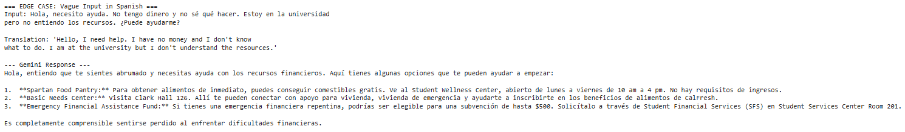

# SJSU Student Resource Navigator
**AI for Social Good | Fundamentals of MIS | Spring 2026**
**SDG 1: No Poverty | SDG 4: Quality Education**

---

## Problem

Maria is a first-generation SJSU student with a financial hold on her
account two weeks before fall registration closes. She works 20 hours
a week, her family earns under $40,000 a year, and her FAFSA disbursement
is delayed. The SJSU website lists programs across six departments with
eligibility requirements written in administrative language she cannot
parse under stress. The exact moment the system breaks down: she lands
on the Student Financial Services page, sees twelve programs, and closes
the tab.

The failure is not that information does not exist. It is that the
information cannot be understood or navigated by the student who needs
it most, at the moment she needs it most.

---

## AI Capability

We use text generation (Lab 1) to bridge the gap between a stressed
student's description of their situation and the specific SJSU resource
that applies to them.

The system prompt functions as a policy layer — the same principle
demonstrated in Lab 1, where a single instruction determined whether
the 311 tool could serve non-English-speaking residents at all. Here,
the system prompt determines whether a student gets directed to the
right office or the wrong one. Text generation fits this failure point
because the problem is translation: converting an emotional, vague
description of distress into a specific, actionable next step. Structured
extraction (Lab 2) would require the student to fill in fields they may
not understand. Image recognition (Lab 3) does not apply.

---

## Workflow

**Input:** Student types a free-text description of their financial
situation in natural language. No forms, no fields, no categories required.

**AI step:** Gemini reads the input against a system prompt containing
knowledge of seven SJSU resources. It identifies the 1-3 most relevant
programs, ranks them by urgency, and returns a plain-language
recommendation with specific actions: where to go, who to contact,
what to bring.

**Output:** A response under 200 words in the student's own language,
ending with an acknowledgment of their situation.

**Who acts:** A peer advisor in the Basic Needs Center reviews any
response flagged as vague or non-English before it reaches the student.
For clear English-language inputs, the response is delivered directly.

---

## Failure Case

**Input:** A Spanish-speaking student sends a vague message with no
specific detail about whether the crisis involves food, housing, fees,
or registration: "Hola, necesito ayuda. No tengo dinero y no sé qué
hacer. Estoy en la universidad pero no entiendo los recursos."

**What Gemini returned:** [paste your actual Cell 9 output here in
1-2 sentences — what did it say and what language did it respond in]

**Real-world consequence:** If the system responds only in English,
the student cannot understand the recommendation. She misses the Fee
Deferral Program deadline, her hold remains, and she cannot register
for the following semester. The student most in need of help is the
one the system fails first.

**Lab connection:** Lab 1 demonstrated that a single line in the
system prompt determines who the tool can serve. When that line is
absent, non-English speakers receive responses they cannot act on.
The same dynamic produced the failure observed in the edge case cell
of this notebook.

---

## Oversight and Tradeoff

**Oversight position:** A peer advisor in the Basic Needs Center
reviews any response before delivery when the student wrote in a
language other than English or when the input was too vague to route
accurately. This is the minimum human checkpoint before the
recommendation has real consequences.

**The one change:** We added a language detection instruction to the
system prompt directing Gemini to respond in the student's language
and to ask one clarifying question rather than guess when input is
vague. This is demonstrated by re-running the same edge case input
against the updated prompt in the notebook.

**What it costs:** This reduces speed. Every vague or non-English
input now triggers either a clarifying exchange adding one round-trip
delay, or a human review queue adding 4 to 24 hours depending on
staffing. For a student with a registration deadline in two days,
that delay is real. We chose accuracy over immediacy because a wrong
recommendation sent instantly causes more harm than a correct one
sent the next morning.
